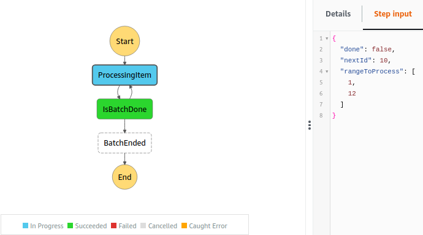
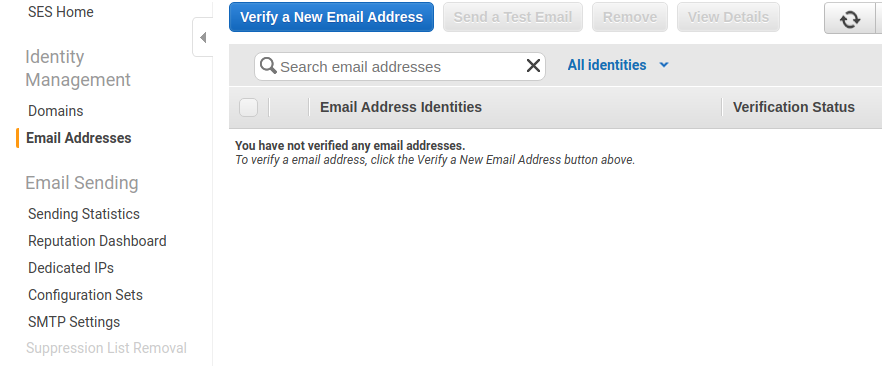

# Step Functions used to process a range of items, each of them processed by a brand-new lambda to renew its timeout 


The state machine receives as input a range of items that should be processed by lambda, for example:
 ```json
{
  "rangeToProcess": [1, 12]
}
 ```

The lambda start processing item 1 and outputs this to the following `Choice` state:
```json
{
    "rangeToProcess": [1, 12],
    "done": false,
    "nextId":  2
}
```
As `done` is `false`, the `Choice` state will relaunch the lambda to process item 2. Once, that's repeated and item 12 processed, `Choice` won't relaunch the lambda and the state machine ends.

This is how it looks like another intermediate state of `ProcessingItem`:
<br />
<p align="center">
  
</p><br />

It's possible to configure how many seconds takes every item to be processed creating an `.env` file like:
```dotenv
TASK_TAKES=<number of seconds>
```
If no `TASK_TAKES` environmental variable is found, it will default to 1s value. The lambda timeout is configured in `serverless.yml` to 10s, you can play with these values to introduce a timeout error.

If an `EMAIL` environmental value is found (which you can also include it in the `.env` file), the lambda will try to send an email when it's close to timeout (3s to timeout actually) and when processing the whole `rangeToProcess` was successful. To make this email delivery work you should add that `EMAIL` to AWS SES:
<br /><br />
<p align="center">
  
</p><br />

Anyway, those two environmental values `TASK_TAKES` and `EMAIL` are optional, you can use this project without creating any `.env` file.

#### Requirements
* AWS CLI
* AWS account
* Serverless Framework

#### Instructions
* Clone the repo and install the dependencies with `npm i`
* [Optional] Create file `.env` so it looks like this:
```dotenv
EMAIL=<your SES verified email>
# How many seconds takes processing 1 item:
TASK_TAKES=<number of seconds>
```
* Configure your aws profile with the aws account credentials you want to use for the deployment
```bash
export AWS_DEFAULT_PROFILE=<your aws profile>
export AWS_PROFILE=$AWS_DEFAULT_PROFILE
export AWS_REGION=<aws region put on serverless.yml>
```
`TIP` You can check your current credentials with `aws configure list` 
* Deploy with
```bash
sls deploy
```
* You can execute the step function with input data from the command line using for example:
```bash
sls invoke stepf --name batchProcessingRenewingTO --data '{ "rangeToProcess": [1, 12] }'
```
...or execute the step function from AWS console GUI, where you can see how the graph changes.

---
Starting repo: [Serverless Node.js Starter](https://github.com/AnomalyInnovations/serverless-nodejs-starter)
